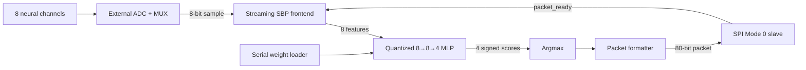

# Learned-Feature Brain-Machine Interface (BMI) ASIC: A Mixed-Signal Chip for Real-Time Neural Intent Classification

An RTL-to-GDS implementation for a real-time brain-machine interface
(BMI) classifier. The digital block converts eight multiplexed ADC channels
into compact neural features, runs a quantized `8 → 8 → 4` multilayer
perceptron, and returns the predicted grasp class and diagnostic scores over
SPI.

Project team: Zachary Tey, Christopher Leung, Rohit Seshadri, Ben
Rivera Flores. The original report is available as
[392-final-report.pdf](392-final-report.pdf).

Verification efforts (vPlan) are detailed in the [verification plan](docs/vPlan.md).

## Why this exists

Over 5 million Americans live with paralysis from stroke, ALS, or spinal cord injury. 
However, restoring communication and motor control requires direct, real-time access to neural signals,
but such signals are far too weak for standard ADCs. Therefore a custom low-noise analog front-end
is essential to digitize them without burying the signal in noise. A 45 nm CMOS integration enables 
a low-power LNA + ADC chain dense enough for high-channel-count chronic recording. 
This repository is the digital backend that interfaces and classifies neural intent coming from the
custom analog front-end. 

Implantable and wearable neural interfaces cannot always stream every raw
sample to a host. Moving simple feature extraction and classification close to
the sensors can reduce output bandwidth and host-side computation while giving
the system deterministic inference latency.

This design explores that idea with a digital accelerator:

- Eight time-multiplexed 8-bit ADC channels
- Streaming feature extraction without storing the complete sample window
- Signed, quantized MLP inference using one reused MAC datapath
- Four grasp/force output classes
- A simple SPI Mode 0 host interface
- Serial loading of model parameters at power-up

The RTL regression demonstrates equivalence to the supplied integer reference
model. It does **not** independently establish clinical validity or biological
classification accuracy.

## Architecture



The frontend rotates through the eight ADC channels and accumulates

```text
feature[ch] = sum(abs(adc_sample - 128)) >> 8
```

for 250 samples per channel. Accumulation happens as samples arrive, so the
current architecture does not store and reread a 2,000-sample window. When all
features are ready, the frontend pauses while the MLP, decision logic, packet
formatter, and SPI transmitter finish. `packet_ready` releases the frontend for
the next window.

### Output classes

| Index | Label | Meaning |
|---:|---|---|
| 0 | PG-LF | Power grasp, low force |
| 1 | PG-HF | Power grasp, high force |
| 2 | SG-LF | Spherical grasp, low force |
| 3 | SG-HF | Spherical grasp, high force |

## RTL blocks

| Module | Responsibility |
|---|---|
| [`bmi_chip_top`](rtl/bmi_chip_top.sv) | Connects the complete pipeline |
| [`streaming_sbp_frontend`](rtl/streaming_sbp_frontend.sv) | ADC channel rotation, streaming accumulation, pause/resume control |
| [`mlp_inference`](rtl/mlp_inference.sv) | Serial parameter storage and time-multiplexed hidden/output MAC operations |
| [`argmax`](rtl/argmax.sv) | Signed four-way maximum with deterministic lowest-index tie breaking |
| [`output_formatter`](rtl/output_formatter.sv) | Holds and formats one result packet until consumed |
| [`spi_slave`](rtl/spi_slave.sv) | Oversampled SPI Mode 0 transmitter |


## Fixed-point inference

The ADC and extracted features are unsigned 8-bit values. Model weights and
biases are signed 8-bit two's-complement integers. Products and running sums
use signed 32-bit accumulators.

The MLP executes:

```text
hidden[j] = ReLU(sum(feature[i] * hidden_weight[j][i])
                 + hidden_bias[j] * HIDDEN_BIAS_SCALE)

score[k]  = sum(hidden[j] * output_weight[k][j])
            + output_bias[k] * OUTPUT_BIAS_SCALE
```

Bias scale factors align quantized biases with the product accumulation domain;
they are generated with the model parameters. The production weight image uses
`HIDDEN_BIAS_SCALE=85` and `OUTPUT_BIAS_SCALE=109`.

Elaboration-time range checks reject parameter combinations whose worst-case
arithmetic cannot fit the configured accumulator or score widths.

## Model loading

The model contains 108 bytes (864 bits):

| Parameter group | Shape | Bytes |
|---|---:|---:|
| Hidden weights | 8 × 8 | 64 |
| Hidden biases | 8 | 8 |
| Output weights | 4 × 8 | 32 |
| Output biases | 4 | 4 |
| **Total** |  | **108** |

Parameters are shifted LSB-first on `scan_in` using `scan_clk`. The load
protocol is:

1. Hold functional `rst_n` low.
2. Pulse `scan_clk` once with `scan_en=0` to clear the length tracker.
3. Assert `scan_en` and shift exactly 864 bits.
4. Deassert `scan_en` without another scan-clock edge.
5. Release functional reset.

Inference remains disabled until the complete image has been counted and the
stable `weights_loaded` level has crossed into the functional clock domain.
Runtime model replacement is not supported.

## SPI interface

The output is a 10-byte, MSB-first SPI Mode 0 packet:

| Byte(s) | Contents |
|---:|---|
| 0 | `0xAA` synchronization byte |
| 1 | `{6'b0, predicted_class[1:0]}` |
| 2–3 | `score[0][31:16]` |
| 4–5 | `score[1][31:16]` |
| 6–7 | `score[2][31:16]` |
| 8–9 | `score[3][31:16]` |

`spi_sclk` and `spi_cs_n` are oversampled in the system-clock domain instead of
forming another internal sequential clock domain. The verified operating rule
is therefore:

```text
f_clk >= 8 × f_spi
```

## Verification

Verification is organized at block and integration levels. Every reusable RTL
block has a self-checking SystemVerilog testbench, and the top-level scoreboard
checks intermediate features, complete MLP scores, the selected class, packet
format, event ordering, latency, backpressure, and unknown values.

Current regression baseline:

| Environment | Current result |
|---|---:|
| Streaming frontend | 5/5 directed tests pass |
| MLP inference | 8/8 directed tests pass |
| Argmax | 17/17 directed tests pass |
| Output formatter | 13/13 directed tests pass |
| SPI transmitter | 11/11 directed tests pass |
| RTL integration | 40/40 generated vectors pass |
| Pipeline protocol monitor | 0 errors across 40 transactions |
| Verilator `-Wall` lint | 0 warnings |

The living requirements, tests, status, and remaining gaps are maintained in
the [verification plan](docs/vPlan.md). A passing 40-vector regression proves
hardware/reference equivalence for those vectors; directed tests provide the
protocol and arithmetic corner cases that vector replay alone cannot cover.

### Run the tests

The simulation scripts use Cadence Xcelium on the university environment:

```bash
cd sim
./run_streaming_frontend.sh
./run_mlp.sh
./run_argmax.sh
./run_output_formatter.sh
./run_spi.sh
./run_rtl.sh
```

Open-source RTL lint can be run separately:

```bash
cd sim
./run_lint.sh
```

## Synthesis status

The current top level synthesizes with Cadence Genus 18.14 using the GPDK045
standard-cell library and a 20 ns (50 MHz) target.

| Metric | Current pre-layout result |
|---|---:|
| Standard cells | 5,046 |
| Cell area | 21,608.928 µm² |
| Estimated net area | 6,992.071 µm² |
| Estimated total area | 28,600.999 µm² |
| Worst reported setup slack | +6.311 ns |
| Critical path | MLP score register through argmax comparison logic |

Run synthesis with:

```bash
cd syn
./run_syn.sh
```

The SDC models the functional and scan clock domains, synchronous ADC input,
asynchronous oversampled SPI inputs, external delays, load, and slew. Timing
lint is used to audit constraint coverage.


## Latency

The frontend consumes one sample per functional clock:

| Stage | Cycles |
|---|---:|
| Eight channels × 250 samples | 2,000 |
| MLP inference | 121 |
| Argmax and formatting | 2 |
| **Capture to packet-valid** | **approximately 2,123** |

At a 10 MHz functional clock, packet-valid is produced in approximately 212 µs.
SPI transfer then takes 80 external SCLK cycles.

## Repository map

```text
rtl/       Synthesizable SystemVerilog and retained legacy frontend
sim/       Self-checking block/integration testbenches and run scripts
sim/vectors/
           ADC stimulus and golden feature/score/class data
ml/        Supplied model, quantization, and vector-generation scripts
docs/      Verification plan and project documentation
syn/       Genus synthesis script, SDC, netlist, and reports
pnr/       Innovus scripts plus historical backend artifacts
results/   Historical result summaries from the original architecture
```